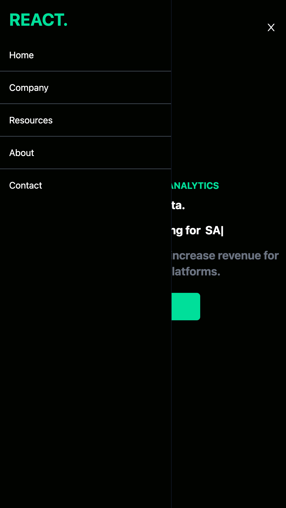

<h1>Data Finances WebPage</h1>

<h2>Pages:</h2>

<h2 align="center">Desktop Version:</h2>
<p align="center"></p>

<hr>

<h2 align="center">Mobile Version:</h2>

<p align="center">
<br/>

&nbsp;

</p>

<h2>Usage: </h2>

```bash

git clone https://github.com/universal-developer/Colors-WebPage

cd Colors Webpage

yarn install

yarn start

```

<hr>

<h2>Link on video:</h2>

<p align="center"><a href="https://www.youtube.com/watch?v=ZU-drSVodBw">PRESS HERE TO WATCH</a></p>
